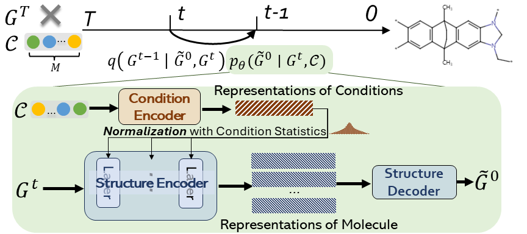
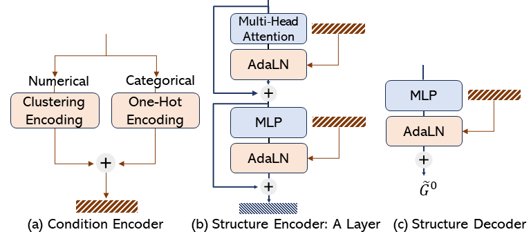

Graph Diffusion Transformer for Multi-Conditional Molecular Generation
================================================================

Paper: https://arxiv.org/abs/2401.13858 (NeurIPS 2024 Oral)

This is the code for Graph DiT. The denoising model architecture in `graph_dit/models` looks like:

<div style="display: flex;" markdown="1">
      
      
</div>

## Update

**May 29** — The Graph DiT models have been integrated into our actively maintained open-source project, [`torch-molecule`](https://github.com/liugangcode/torch-molecule). This package provides scikit-learn–style interfaces for a wide range of molecular generation, prediction, and representation models. In addition to Graph DiT, it includes implementations of DiGress, GDSS, and other molecular generation methods.


## Requirements
All dependencies are specified in the `requirements.txt` file.

This code was developed and tested with Python 3.9.16, PyTorch 2.0.0, and PyG 2.3.0, Pytorch-lightning 2.0.1.

For molecular generation evaluation, we should first install rdkit.

Then `fcd_torch`: `pip install fcd_torch` (https://github.com/insilicomedicine/fcd_torch).

And `mini_moses` package: `pip install git+https://github.com/igor-krawczuk/mini-moses` (https://github.com/igor-krawczuk/mini-moses),

## Usage

We could train the model on an A6000 GPU card. Here is an example to running the code for polymer graphs:

```
python main.py --config-name=config.yaml \
                model.ensure_connected=True \
                dataset.task_name='O2-N2-CO2' \
                dataset.guidance_target='O2-N2-CO2'
```
All default configurations can be found in `configs/config.yaml`. In this example, we set `model.ensure_connected=True` to ensure that all generated components are retained during graph-to-molecule conversion (see paper Section 3.2).

Other examples for small molecule generation:

```
python main.py --config-name=config.yaml \
                dataset.task_name='bace_b' \
                dataset.guidance_target='Class'

python main.py --config-name=config.yaml \
                dataset.task_name='bbbp_b' \
                dataset.guidance_target='p_np'

python main.py --config-name=config.yaml \
                dataset.task_name='hiv_b' \
                dataset.guidance_target='HIV_active'
```

We could generate polymer graphs by conditioning on single gas permeability.

```

python main.py --config-name=config.yaml \
                dataset.task_name='O2' \
                dataset.guidance_target='O2'

python main.py --config-name=config.yaml \
                dataset.task_name='N2' \
                dataset.guidance_target='N2'

python main.py --config-name=config.yaml \
                dataset.task_name='CO2' \
                dataset.guidance_target='CO2'
```

Feel free to test the code on your own dataset!

## Citation

If you find this repository useful, please cite our paper:

```
@inproceedings{liu2024graphdit,
  title={Graph Diffusion Transformers for Multi-Conditional Molecular Generation},
  author={Liu, Gang and Xu, Jiaxin and Luo, Tengfei and Jiang, Meng},
  booktitle={The Thirty-eighth Annual Conference on Neural Information Processing Systems},
  year={2024}
}
```

